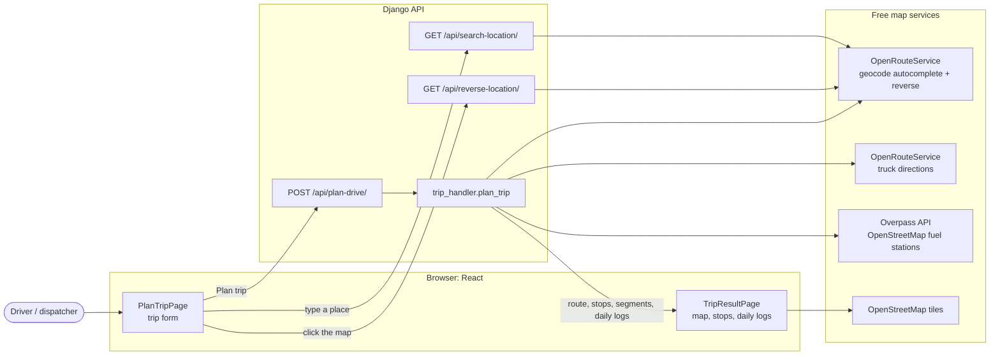
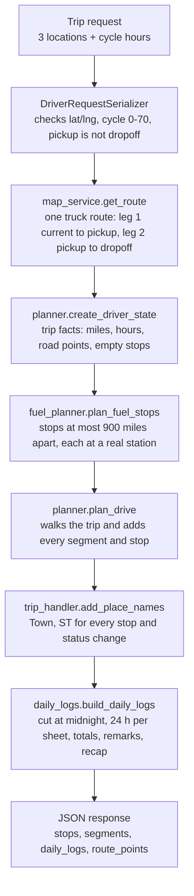
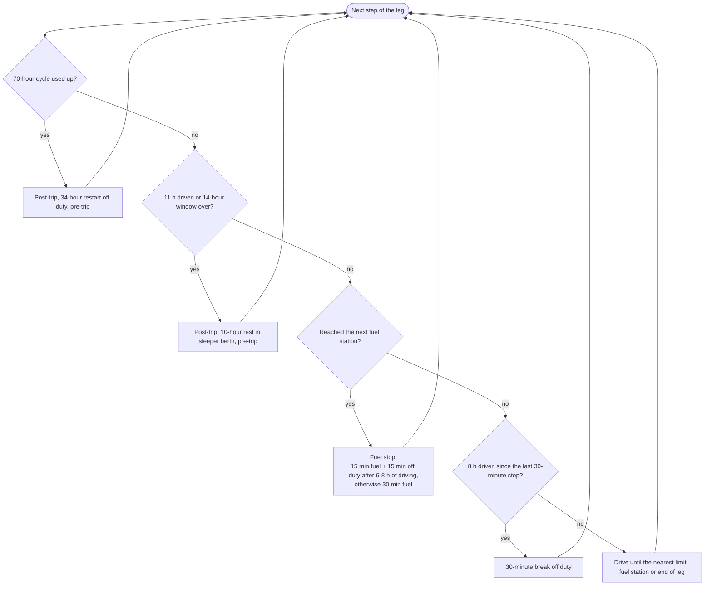
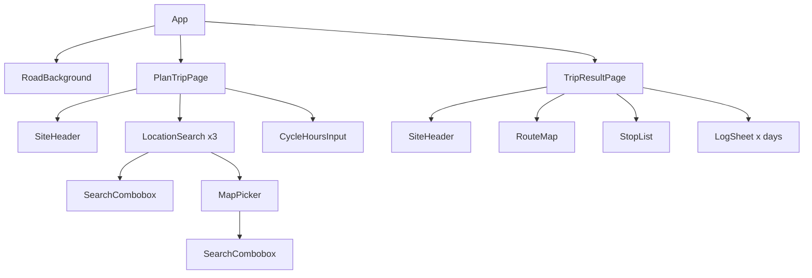

# Project structure

HOS Trip Planner takes a trip (where the truck is, the pickup, the dropoff and the hours already used in the current cycle) and returns a truck route on a map plus one filled-in driver's daily log per day, following the FMCSA hours-of-service rules for property-carrying drivers (70 hours / 8 days).

- **Backend:** Django + Django REST Framework. It plans the trip.
- **Frontend:** React + Vite. It collects the trip and draws the map and the logs.

## How the pieces talk



The OpenRouteService API key stays on the server (`backend/.env`). The browser only talks to our own Django API.

## What happens when you press "Plan trip"



### Inside `plan_drive`

Before every piece of driving, the planner checks the limits in this order and does exactly one thing:



A trip is: pre-trip inspection, leg 1, 1-hour pickup, leg 2, 1-hour dropoff, post-trip inspection.

## Folders and files

```
hos/
├── backend/                          Django project
│   ├── manage.py
│   ├── requirements.txt
│   ├── .env.example                  ORS_API_KEY=  (copy to .env)
│   ├── config/
│   │   ├── settings.py               apps, CORS, DRF exception handler, loads .env
│   │   └── urls.py                   /api/ -> hos_planner.urls
│   └── hos_planner/                  the app
│       ├── urls.py                   plan-drive, search-location, reverse-location
│       ├── views.py                  the three API views
│       ├── constants.py              every HOS number in one place (11, 14, 8, 70, 1000, ...)
│       ├── tests.py                  unit and API tests (map services are mocked)
│       ├── api/
│       │   ├── serializers.py        request validation
│       │   ├── responses.py          common {success, data | error} format
│       │   └── exceptions.py         MapServiceError, RouteNotFoundError, exception handler
│       ├── services/
│       │   └── map_service.py        OpenRouteService + Overpass calls, distance math
│       └── planner/
│           ├── trip_handler.py       plan_trip: runs every step in order
│           ├── planner.py            driver state + the hour-by-hour walk (plan_drive)
│           ├── checkers.py           "hours left" and "limit reached" for each rule
│           ├── fuel_planner.py       where to fuel and which real station
│           ├── break_planner.py      early stub, breaks are now planned inside plan_drive
│           └── daily_logs.py         segments -> one 24-hour log sheet per day
│
├── frontend/                         React + Vite
│   ├── index.html
│   ├── package.json
│   ├── .env.example                  VITE_API_URL=http://127.0.0.1:8000
│   ├── public/
│   │   ├── logo.png
│   │   └── favicon.png
│   └── src/
│       ├── main.jsx                  entry, global styles
│       ├── App.jsx                   form state + switches between the two pages
│       ├── api.js                    fetch calls to the Django API
│       ├── validation.js             form checks + server error mapping
│       ├── time.js                   time and hour formatting
│       ├── stopTypes.js              label and icon for each stop type
│       ├── index.css                 design tokens (colors, fonts)
│       ├── App.css                   input page styles
│       ├── result.css                results page, log sheet and print styles
│       ├── pages/
│       │   ├── PlanTripPage.jsx      the trip form
│       │   └── TripResultPage.jsx    summary, map, stops, daily logs
│       └── components/
│           ├── LocationSearch.jsx    a location field: search box + "Choose on map"
│           ├── SearchCombobox.jsx    accessible search with suggestions
│           ├── MapPicker.jsx         map dialog to click or search a point
│           ├── CycleHoursInput.jsx   cycle hours field with an hours-left gauge
│           ├── RouteMap.jsx          route line and stop markers (Leaflet)
│           ├── StopList.jsx          stops in time order
│           ├── LogSheet.jsx          the driver's daily log drawn in SVG
│           ├── RoadBackground.jsx    decorative road and truck background
│           ├── SiteHeader.jsx        logo header
│           └── icons.jsx             outline icons
│
├── blank-paper-log.png               the paper log the SVG sheet is based on
├── fmcsa-hos-395-drivers-guide-to-hos-2022-04-28-0-1-.pdf   the HOS rules
├── fmsca-image.png                   the guide sections used
├── new-full-stack-dev-assessment.docx   the assessment brief
├── logo.jpeg                         original logo
├── README.md
└── STRUCTURE.md                      this file
```

## Frontend screens



## Run it locally

```
cd backend
python -m venv venv
venv/Scripts/pip install -r requirements.txt     (Windows; use venv/bin on macOS/Linux)
copy .env.example to .env and set ORS_API_KEY
venv/Scripts/python manage.py runserver 8000

cd frontend
npm install
npm run dev -- --host 127.0.0.1 --port 5173
```

Then open http://127.0.0.1:5173.
